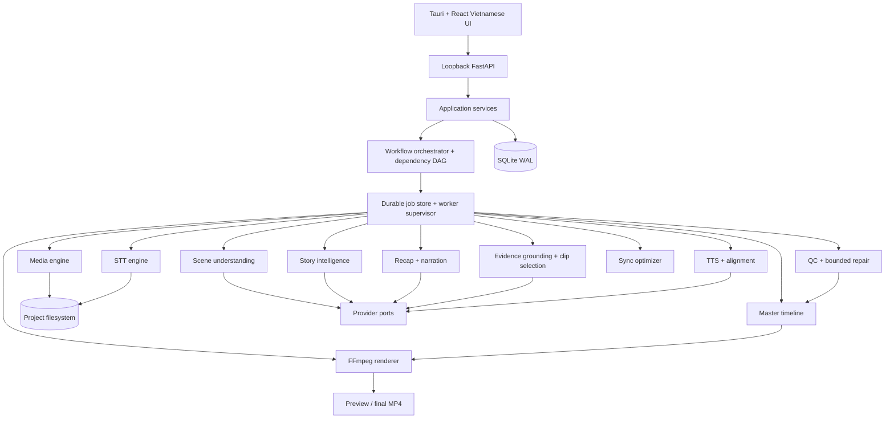

# AI Recap Video — Implementation-Ready Software Blueprint

Status: `PLANNED`  
Architecture baseline: local-first hybrid modular monolith  
Target: Windows 11, i5-12400F, 32 GB RAM, RTX 3060 12 GB

## A. Architecture Summary

The product is a non-destructive desktop video editor whose central invariant is:

```text
Every narration claim -> validated event -> source evidence -> selected footage
```

The application uses five boundaries:

1. **Tauri desktop shell + React/TypeScript UI** — Vietnamese easy-mode UX, editor, timeline, progress, settings.
2. **Loopback application API** — FastAPI on `127.0.0.1`, launched and supervised by Tauri. A random per-launch token protects HTTP/WebSocket access. It is never exposed to the LAN.
3. **Python modular monolith** — domain services, workflow orchestration, provider ports, validation, and dependency invalidation in one deployable backend.
4. **Bounded worker processes** — CPU/GPU/media tasks run outside the UI/API process and report durable progress through the job store. This is not a distributed queue.
5. **SQLite + project filesystem** — SQLite stores identities, relationships, states, revisions, and hashes; large media and generated artifacts stay on disk.

Key decisions:

- Full episode understanding is immutable analysis input for many recap revisions: `ANALYZE ONCE -> GENERATE MANY`.
- The master timeline is the only render contract. The renderer has no story reasoning.
- Every generated object carries `schema_version`, provenance, source identity, and revision identity.
- Stage outputs are content-addressed by source hash plus causally relevant configuration/model/prompt/schema versions.
- Regeneration follows an explicit dependency DAG; locked timeline segments are hard constraints.
- Provider adapters return validated domain DTOs. Provider-specific response shapes never enter domain services.
- A candidate clip cannot be selected if it lacks evidence overlap, crosses excluded regions, leaks a future payoff, or cannot cover narration naturally.
- UI operations are autosaved as append-only revisions; source files are read-only.
- Paid API fallback is opt-in policy, never an automatic hidden cost.

## B. Component Diagram



Module dependencies point inward:

```text
UI -> API DTOs -> application services -> domain
                                   -> provider/media ports
infrastructure adapters ----------> ports
```

Domain modules never import FastAPI, FFmpeg wrappers, provider SDKs, SQLite, or Tauri.

## C. Data Flow

```text
Episode file
-> SHA-256 identity + ffprobe manifest
-> 720p proxy + PCM audio
-> timestamped transcript
-> shots + representative/action frames + excluded regions
-> scenes + ScenePackages
-> characters + atomic events + plots + causal StoryGraph
-> RecapProfile + StoryBudget + RecapPlan revision
-> sentence-sized NarrationUnits
-> claim/event/time-range EvidenceLinks
-> TTS assets + measured/aligned duration
-> evidence-safe ClipCandidates
-> constrained sync solution
-> immutable MasterTimeline revision
-> subtitles + preview
-> semantic/media/audio QC
-> bounded segment repair when allowed
-> final render from original source
-> final MP4 + render manifest + QC report
```

Every arrow writes a checkpoint only after output validation and atomic artifact publication. Interrupted stages resume from the latest valid checkpoint. A changed input invalidates only descendants in the dependency DAG.

## D. Local vs API Responsibility

| Responsibility | Local default | Optional API | Rule |
|---|---|---|---|
| File identity, ffprobe, proxy, audio, frames, shots | Yes | No | Source never mutated |
| STT | Faster-Whisper CUDA | STT provider | AUTO prefers healthy local path |
| Speaker/character resolution | Pre/post-processing | LLM/vision | Unknown stays unknown |
| Scene semantic analysis | Package construction | Vision/LLM | Send sampled frames + transcript, not full episode |
| Event/plot/story reasoning | Validation/storage | Strong reasoning model | Structured output only |
| Recap planning/narration | Constraints/validation | LLM | Claims must reference known events |
| Embeddings/similarity | Local when practical | Embedding API | Versioned index |
| TTS | Cache/measurement/mix | Configured TTS provider | Per NarrationUnit |
| Clip scoring/sync | Yes | Optional semantic scorer | Hard gates remain local |
| Timeline/subtitles/render/QC media checks | Yes | No | Final uses original source |
| Credentials | Windows secure store | Provider authentication | Never stored in project/DB plaintext |

## E. Repository Structure

```text
ai-recap-video/
├── apps/
│   ├── desktop/                 # Tauri v2 shell and sidecar lifecycle
│   │   ├── src-tauri/
│   │   └── src/
│   └── api/                     # FastAPI composition root
├── backend/
│   ├── recap_core/
│   │   ├── api/                 # HTTP/WS DTO translation only
│   │   ├── application/         # use cases and orchestration
│   │   ├── domain/
│   │   │   ├── media/
│   │   │   ├── transcript/
│   │   │   ├── scene/
│   │   │   ├── story/
│   │   │   ├── recap/
│   │   │   ├── grounding/
│   │   │   ├── voice/
│   │   │   ├── timeline/
│   │   │   ├── qc/
│   │   │   └── jobs/
│   │   ├── ports/               # repository/provider/media/clock/event ports
│   │   ├── infrastructure/
│   │   │   ├── database/
│   │   │   ├── ffmpeg/
│   │   │   ├── providers/
│   │   │   ├── credentials/
│   │   │   ├── filesystem/
│   │   │   └── workers/
│   │   ├── schemas/             # versioned JSON schemas
│   │   ├── prompts/             # prompt_id/version/schema binding
│   │   └── settings/
│   └── tests/
│       ├── unit/
│       ├── integration/
│       ├── contract/
│       ├── fixtures/
│       └── acceptance/
├── frontend/
│   ├── src/
│   │   ├── app/
│   │   ├── pages/{Home,Projects,RecapSetup,Processing,StoryReview,Editor,Settings}/
│   │   ├── features/{import,recap,storyboard,timeline,voice,export}/
│   │   ├── components/
│   │   ├── services/
│   │   ├── state/
│   │   ├── types/
│   │   └── ui/
│   └── tests/
├── migrations/
├── schemas/                     # language-neutral published contracts
├── docs/
│   ├── contracts/
│   ├── decisions/
│   └── test-fixtures/
├── scripts/
├── pyproject.toml
├── package.json
└── README.md
```

Runtime project directory:

```text
Project/
├── source/          # imported reference or managed copy, immutable
├── proxy/
├── metadata/
├── transcript/
├── scenes/keyframes/
├── story/
├── recap/
├── voice/
├── timeline/
├── subtitles/
├── previews/
├── renders/
├── qc/
├── cache/
└── logs/
```

## F. Database Design

SQLite runs in WAL mode with foreign keys enabled. Schema changes use numbered forward migrations; deleting the DB is never a migration strategy.

Core identity and storage tables:

| Table | Essential columns | Relationships / constraints |
|---|---|---|
| `projects` | id, name, root_path, status, created_at | root_path unique |
| `episodes` | id, project_id, ordinal, source_path, source_sha256, duration_ms, media_json | project 1:N; `(project_id, ordinal)` unique |
| `artifacts` | id, episode_id, kind, path, sha256, size, producer_version, cache_key, state | path/hash identity; published atomically |
| `artifact_dependencies` | artifact_id, depends_on_artifact_id | dependency DAG, no self-edge |
| `analysis_revisions` | id, episode_id, config_hash, status, created_at | immutable after complete |
| `recap_revisions` | id, analysis_revision_id, profile_json, status | many per analysis |
| `timeline_revisions` | id, recap_revision_id, parent_id, status, created_at | append-only revision chain |

Analysis tables:

| Table | Essential columns |
|---|---|
| `transcript_segments` | id, analysis_revision_id, start_ms, end_ms, speaker_id, text, words_json, confidence |
| `shots` | id, analysis_revision_id, start_ms, end_ms, keyframes_json, excluded_reason |
| `scenes` | id, analysis_revision_id, start_ms, end_ms, location, summary, confidence, schema_version |
| `scene_shots` | scene_id, shot_id, ordinal |
| `characters` | id, analysis_revision_id, canonical_name, status, aliases_json, refs_json |
| `scene_characters` | scene_id, character_id, confidence |
| `events` | id, scene_id, start_ms, end_ms, action, cause, consequence, importance, confidence |
| `event_characters` | event_id, character_id, role |
| `plots` | id, analysis_revision_id, title, summary, importance |
| `plot_events` | plot_id, event_id, ordinal, membership_score |
| `story_edges` | id, analysis_revision_id, from_event_id, to_event_id, relation, confidence |
| `evidence_items` | id, event_id, type, start_ms, end_ms, transcript_id, artifact_id, confidence |

Generation/edit tables:

| Table | Essential columns |
|---|---|
| `recap_plans` | id, recap_revision_id, selected_plots_json, estimated_ms, policy_json |
| `recap_plan_events` | plan_id, event_id, ordinal, budget_class, decision_reason |
| `narration_units` | id, recap_revision_id, ordinal, text, plot_id, confidence, locked, content_hash |
| `narration_events` | narration_id, event_id, ordinal |
| `narration_evidence` | narration_id, evidence_id, claim_ordinal, support_score |
| `clip_candidates` | id, narration_id, start_ms, end_ms, scores_json, hard_gate_json, rank |
| `voice_assets` | id, narration_id, artifact_id, provider, model, voice_id, duration_ms, alignment_json, cache_key |
| `timeline_segments` | id, timeline_revision_id, narration_id, ordinal, start_ms, end_ms, locked, data_json |
| `timeline_sources` | segment_id, episode_id, source_in_ms, source_out_ms, speed, track_order |
| `qc_results` | id, timeline_revision_id, scope_type, scope_id, code, severity, score, evidence_json, repair_state |
| `jobs` | id, project_id, stage, scope_type, scope_id, state, attempts, max_attempts, progress, input_hash, lease_until, error_json |
| `job_events` | id, job_id, sequence, state, message_key, data_json, created_at |
| `settings` | scope, scope_id, key, value_json, schema_version |
| `cost_entries` | id, project_id, job_id, provider, model, units_json, estimated_cost, currency |

Important constraints:

- All time ranges satisfy `0 <= start_ms < end_ms <= episode.duration_ms`.
- Completed revision rows are immutable; edits create children.
- Timeline source rows reference the exact episode SHA through their revision/artifact chain.
- A `narration_unit` cannot enter `READY_FOR_TIMELINE` without at least one validated evidence link.
- Locked segment content is copied unchanged into descendant timeline revisions unless explicitly unlocked by the user.

## G. Domain Models

- `Project`: workspace and durable settings boundary.
- `Episode`: immutable source identity and media metadata.
- `AnalysisRevision`: complete episode-understanding snapshot.
- `Shot`: camera-cut interval; never treated as a semantic scene by itself.
- `Scene`: coherent story interval composed of ordered shots.
- `ScenePackage`: transcript slice, representative/action frames, audio cues, neighbors, excluded flags, and provenance supplied to a model.
- `Character`: resolved identity or explicit `UNKNOWN` state with aliases/evidence.
- `Event`: atomic claim anchored to one scene and source range.
- `Plot`: ordered event membership; no fixed plot count.
- `StoryGraph`: typed causal/semantic edges over known events.
- `RecapProfile`: style, compression, language, focus character, dialogue policy, optional maximum duration.
- `StoryBudget`: `MUST_HAVE | SHOULD_HAVE | OPTIONAL` decisions with rationale.
- `RecapPlan`: ordered selected events/plots and compression/dialogue decisions.
- `NarrationUnit`: one speakable semantic unit and its claims, events, evidence, voice, and lock state.
- `EvidenceItem`: authoritative transcript/visual/time-range support.
- `ClipCandidate`: evidence-compatible source interval plus hard-gate and ranking scores.
- `VoiceAsset`: immutable unit-level audio with measured duration and optional alignment.
- `TimelineSegment`: non-destructive composition of sources, narration, original audio, subtitles, and transitions.
- `QCResult`: code, severity, scope, evidence, repairability, and repair history.
- `Job`: durable, idempotent stage execution over an explicit input hash.

## H. JSON Schemas

All schemas use JSON Schema 2020-12, `additionalProperties: false`, integer milliseconds, UUID identifiers, and a required `schema_version`. The repository publishes full schemas under `schemas/v1/`; the following are canonical shapes.

```json
{
  "$defs": {
    "TimeRange": {
      "type": "object",
      "required": ["start_ms", "end_ms"],
      "properties": {"start_ms": {"type": "integer", "minimum": 0}, "end_ms": {"type": "integer", "exclusiveMinimum": 0}},
      "additionalProperties": false
    },
    "Provenance": {
      "type": "object",
      "required": ["source_sha256", "producer", "producer_version"],
      "properties": {
        "source_sha256": {"type": "string", "pattern": "^[a-f0-9]{64}$"},
        "producer": {"type": "string"},
        "producer_version": {"type": "string"},
        "prompt_id": {"type": ["string", "null"]},
        "prompt_version": {"type": ["string", "null"]},
        "model": {"type": ["string", "null"]}
      },
      "additionalProperties": false
    }
  }
}
```

Required object fields:

| Schema | Required fields | Critical validation |
|---|---|---|
| `Scene` | schema_version, id, episode_id, range, shot_ids, character_ids, location, summary, confidence, provenance | ordered shots; range contains every shot |
| `Event` | schema_version, id, scene_id, range, character_ids, action, cause, consequence, importance, evidence_ids, confidence | range inside scene; evidence non-empty before acceptance |
| `Plot` | schema_version, id, title, summary, importance, event_ids | event order valid; no unknown event IDs |
| `StoryGraph` | schema_version, analysis_revision_id, event_ids, plots, edges, provenance | edge endpoints exist; relation enum `CAUSE/EFFECT/SETUP/PAYOFF/REVEAL/REACTION/CONSEQUENCE` |
| `RecapPlan` | schema_version, recap_revision_id, profile, selected_plots, ordered_events, budget, dialogue_decisions, estimated_duration_ms | MUST_HAVE omissions require explicit reason; max duration is upper bound |
| `NarrationUnit` | schema_version, id, plot_id, text, event_ids, evidence_links, confidence, locked | nonblank spoken text; claims cannot reference unknown events |
| `ClipCandidate` | schema_version, id, narration_id, episode_id, range, evidence_ids, scores, hard_gates, rank | all hard gates pass; finite scores in `[0,1]` |
| `TimelineSegment` | schema_version, id, narration_id, range, video_sources, voice_asset_id, gains, subtitle_cues, locked | output duration matches sources after speed; speed in policy range |
| `QCResult` | schema_version, id, timeline_revision_id, scope, code, severity, status, score, evidence, repairable, attempts | failed checks require evidence; attempts bounded |

Representative `NarrationUnit` schema:

```json
{
  "$schema": "https://json-schema.org/draft/2020-12/schema",
  "$id": "https://ai-recap.local/schemas/v1/narration-unit.json",
  "type": "object",
  "additionalProperties": false,
  "required": ["schema_version", "id", "plot_id", "text", "event_ids", "evidence_links", "confidence", "locked"],
  "properties": {
    "schema_version": {"const": "1.0.0"},
    "id": {"type": "string", "format": "uuid"},
    "plot_id": {"type": ["string", "null"], "format": "uuid"},
    "text": {"type": "string", "minLength": 1},
    "event_ids": {"type": "array", "minItems": 1, "uniqueItems": true, "items": {"type": "string", "format": "uuid"}},
    "evidence_links": {
      "type": "array", "minItems": 1,
      "items": {
        "type": "object", "additionalProperties": false,
        "required": ["claim_ordinal", "event_id", "evidence_id", "support_score"],
        "properties": {
          "claim_ordinal": {"type": "integer", "minimum": 0},
          "event_id": {"type": "string", "format": "uuid"},
          "evidence_id": {"type": "string", "format": "uuid"},
          "support_score": {"type": "number", "minimum": 0, "maximum": 1}
        }
      }
    },
    "confidence": {"type": "number", "minimum": 0, "maximum": 1},
    "locked": {"type": "boolean"}
  }
}
```

Cross-field constraints not expressible safely in JSON Schema are enforced by domain constructors and contract tests.

## I. Workflow State Machine

Project workflow:

```text
NEW -> IMPORTING -> PREPROCESSING -> TRANSCRIBING -> SCENE_DETECTION
-> ANALYZING -> STORY_BUILDING -> PLANNING -> SCRIPTING -> GROUNDING
-> VOICE_GENERATION -> CLIP_SELECTION -> SYNCING -> TIMELINE_BUILDING
-> PREVIEW_READY -> RENDERING -> QC -> COMPLETED
```

Each stage may enter `PAUSED`, `CANCEL_REQUESTED`, `CANCELLED`, or a typed failure such as `FAILED_TRANSCRIPTION`. Resume selects the first invalid or incomplete DAG node, not a fixed earlier stage.

Job states:

```text
PENDING -> READY -> RUNNING -> SUCCEEDED
                    |-> RETRY_WAIT -> READY
                    |-> FAILED
                    |-> CANCELLED
                    |-> INTERRUPTED -> READY
```

Rules:

- Jobs are idempotent by `(stage, scope, input_hash)`.
- Worker leases expire after crash; only abandoned `RUNNING` jobs become `INTERRUPTED`.
- Automatic retries are stage-specific, bounded, and require a retryable error class.
- TTS and scene-analysis retries are scoped to one unit/scene.
- Schema-invalid provider output receives one structured repair attempt, then one fresh bounded call if policy permits, then fails closed.
- A paid fallback provider runs only when its configured cost policy authorizes it.
- Cancel stops scheduling new work, terminates cooperative children, and preserves completed checkpoints.

## J. Media Pipeline

1. Probe with ffprobe JSON; validate duration, streams, rotation, time base, color metadata, and decodability.
2. Hash source bytes in a streaming worker. Store source path and identity; never rewrite it.
3. Create a CFR-or-source-compatible 720p proxy using NVDEC/NVENC when capability probing succeeds, otherwise software fallback.
4. Extract mono 16 kHz PCM for STT and a separate original-audio reference.
5. Detect cuts via PySceneDetect/OpenCV/FFmpeg; extract keyframes and additional high-motion/action samples.
6. Detect excluded regions using location in episode, repeated visual/audio fingerprints, black/title patterns, OCR/credits heuristics, and model confirmation.
7. Build preview clips from proxies. Build final output by translating timeline ranges back to original-source timestamps.
8. Render via an explicit filter graph: trim -> setpts -> audio trim/mix -> subtitles -> encode.
9. Prefer H.264 NVENC 1080p/AAC; offer HEVC explicitly; never upscale without user intent.

Each command has a finite timeout, captured stderr, deterministic output path, and atomic `.partial -> final` promotion after validation.

## K. STT Architecture

`STTProvider.transcribe(audio, language, options) -> Transcript` is the port.

- `LocalFasterWhisperProvider`: default AUTO path; CUDA compute type chosen by capability/VRAM; chunking retains overlap and merges timestamps deterministically.
- `OpenAISttProvider` or future adapters: optional fallback, same DTO.
- Health probe checks model availability, CUDA, and a tiny packaged sample before selecting local.
- Transcript stores segment timestamps, optional word timestamps, speaker labels, language, confidence, provider/model/version, and source-audio hash.
- Diarization is optional in the first slice; unknown speakers remain stable IDs.
- Changing STT settings invalidates transcript and all analysis descendants, but not media probe/proxy when their cache keys are unchanged.

## L. Scene Analysis Architecture

```text
Shots -> continuity grouping -> Scene candidate -> ScenePackage -> structured model output -> validated Scene
```

Grouping uses temporal adjacency, color/visual continuity, location embeddings, character overlap, transcript turns, silence/music boundaries, and maximum-duration guards. ScenePackage includes only sampled frames, transcript slice, adjacent-scene summaries, motion/OCR/audio features, shot IDs, time ranges, and provenance.

Model output cannot alter authoritative time ranges or source IDs. It may label location, visible actions, participants, objects, reactions, and summary. Missing certainty produces unknown values, not guessed identities.

## M. Story Intelligence

1. Extract atomic events per scene with evidence references.
2. Resolve characters across speaker IDs, visual references, aliases, and scene context; preserve uncertainty.
3. Cluster events into a variable number of plots using semantic similarity plus character/location/causal overlap.
4. Ask a strong reasoning model to refine plot membership and typed causal edges using the complete episode event set in bounded chunks plus a reconciliation pass.
5. Validate graph endpoints, chronology exceptions, evidence coverage, cycles, setup/payoff completeness, and unsupported claims.
6. Compute narrative importance from conflict, reveal, consequence, emotion, humor, character development, payoff, and uniqueness—never screen time alone.

The StoryGraph is an immutable analysis artifact reused by every recap style.

## N. Recap Planner

Input: StoryGraph + `RecapProfile`.

The planner first creates StoryBudget classes. `MUST_HAVE` covers causal bridges, major reveals/consequences, and required setup/payoff. `SHOULD_HAVE` carries useful context/subplots. `OPTIONAL` is removed first.

Style policies affect selection and pacing:

- Full plot: broad plot/subplot coverage and explanatory clarity.
- Fast & focused: denser narration, major events, preserved causal chain.
- Cinematic: fewer narration units, more dialogue/reaction/ambience.
- Character: subgraph of direct participation plus causally impactful off-screen events.

Duration is estimated from speech rate, dialogue holds, evidence availability, and transitions. `max_duration` is a hard upper bound, not a fill target. If infeasible without dropping MUST_HAVE events, planner reports the conflict for the user instead of silently damaging story coherence.

## O. Narration Engine

- Generate spoken Vietnamese (or selected language), not article prose.
- One unit expresses one visualizable semantic event; split multi-event sentences when evidence/time ranges diverge.
- Every generated claim must reference known event IDs in structured output.
- Validate names, chronology, duplicates, unsupported facts, pronunciation hints, length, and style.
- Unit content hash includes text, voice-relevant language, prompt/model/schema versions, and referenced events.
- Editing one unit creates a recap revision and invalidates only that unit's evidence if semantic claims changed, then voice/sync/timeline descendants.

## P. Evidence Grounding

Grounding operates at claim level:

```text
claim -> event IDs -> evidence items -> authoritative source ranges -> semantic verification
```

Hard requirements:

- Every claim has at least one evidence item.
- All evidence IDs exist under the same analysis/source identity.
- Source ranges overlap the referenced event/scene or have a justified adjacent/reaction relation.
- Payoff evidence cannot be exposed before its story position.
- Contradictory dialogue/visual evidence fails the unit.

Low-confidence units return `NEEDS_REWRITE` or `NEEDS_REVIEW`; they never silently enter the timeline.

## Q. Clip Selection

Candidate generation begins only from evidence ranges plus bounded same-event adjacent/reaction shots. Excluded regions and future-payoff ranges are removed before scoring.

Initial score:

```text
0.30 semantic_match
+ 0.25 event_match
+ 0.15 character_match
+ 0.10 temporal_match
+ 0.10 visual_quality
+ 0.05 continuity
+ 0.05 spoiler_safety
- reuse_penalty
- retime_penalty
```

All values are finite `[0,1]`. Hard gates override score: valid source identity, evidence coverage, no excluded region, no spoiler leak, minimum usable duration, and allowed rights/source. Ranking keeps score components and evidence for QC/debugging.

## R. Sync Engine

The optimizer selects one or more evidence-compatible clips whose adjusted duration covers measured voice and optional original dialogue while minimizing:

```text
semantic mismatch + uncovered voice + retime + excessive cuts + reuse + discontinuity
```

Hard constraints: selected evidence, spoiler order, locked segments, source bounds, no unrelated fill, and natural retiming policy (`0.90–1.10` default; `0.85–1.15` exceptional).

Fallback hierarchy is binding:

1. Shorten/rewrite narration without losing the claim.
2. Apply small natural TTS rate adjustment.
3. Add relevant reaction/establishing/adjacent evidence.
4. Extend source range while still semantically relevant.
5. Moderate video retiming.
6. Split the NarrationUnit.
7. Remove low-value narration.
8. Fail for review.

The engine never stretches 5 seconds of evidence to cover 12 seconds blindly.

## S. TTS Layer

`TTSProvider.synthesize(unit, voice, options) -> VoiceAsset` supports ElevenLabs first and additional adapters later. Provider capability metadata declares alignment, languages, formats, rate control, and cost.

- Generate/cache one asset per NarrationUnit.
- Measure decoded duration locally even when provider reports a duration.
- Normalize loudness and format without overwriting raw provider output.
- Use provider word alignment when trustworthy; otherwise forced alignment or measured cue approximation.
- Changing voice invalidates voice/sync/timeline/render only.
- Retries and fallback are unit-scoped and bounded by explicit cost policy.

## T. Timeline Engine

MasterTimeline is an immutable revision containing ordered segments and tracks:

- `VIDEO`: one or more exact episode source ranges and speed.
- `NARRATION`: immutable VoiceAsset reference.
- `ORIGINAL_AUDIO`: gain/ducking envelopes and preserved dialogue windows.
- `SUBTITLE`: cues derived after final TTS/alignment.
- optional `MUSIC`: user-authorized assets only.

Easy storyboard and advanced timeline edit the same model. Operations are commands (`EditNarration`, `ReplaceClip`, `ChangeVoice`, `MoveBoundary`, `LockSegment`) validated by domain rules and autosaved as a new revision. Locked fields cannot be changed by regeneration. Preview maps to proxy; final render resolves the same source ranges against original files.

## U. QC & Auto Repair

QC layers:

- Story: major plot/setup/payoff coverage, chronology, unsupported/hallucinated claims, character confusion, duplicate information.
- Sync/visual: claim-to-current-clip match, event/character/time match, spoilers, excluded/duplicate/unrelated footage.
- Video: black/frozen frames, abrupt speed, bad transitions, decode/render errors.
- Audio: clipping, LUFS range, narration masking, dialogue collision, long silence, unnatural rate.
- Timeline: gaps/overlaps, missing assets, source identity drift, invalid duration math, locked-segment drift.

Every result has a code, severity, affected IDs, raw evidence, threshold/version, and repairability. Auto repair is segment-scoped and bounded:

```text
alternate candidate -> narration rewrite -> TTS -> affected sync/timeline -> QC once
```

Maximum attempts are explicit. Locked segments are reported, never auto-repaired. `NARRATION_VISUAL_MISMATCH` and `VISUAL_SPOILER_LEAK` block final acceptance.

## V. Resource Manager

First-launch capability detection records CPU, RAM, GPU/VRAM, CUDA, NVDEC/NVENC, FFmpeg, disks, and measured smoke-test capability. The default balanced profile for the baseline machine is:

| Resource | Initial limit |
|---|---:|
| CPU worker processes | 3 |
| Heavy FFmpeg jobs | 1 |
| Local CUDA STT jobs | 1 |
| Other heavy GPU jobs while STT runs | 0 |
| API scene requests | 3 |
| Lightweight thumbnail jobs | 2 |

Guards:

- Available RAM below 8 GB reduces new concurrency; below 4 GB blocks new heavy jobs.
- Reserve VRAM headroom; do not overlap STT, heavy CUDA vision, and GPU render beyond measured budget.
- GPU temperature is advisory unless a reliable sensor is present.
- UI/API/orchestrator never waits synchronously for heavy work.
- Presets alter limits, not correctness constraints.

## W. Storage Strategy

- Stream-hash sources; store media outside SQLite.
- Artifact path includes project/revision/stage/identity, while DB records exact hash/size.
- Cache key includes source hash, relevant config, provider/model, prompt version, schema version, and producer version.
- Write to unique `.partial` files, validate, fsync when important, then atomically rename.
- Estimate proxy/audio/frame/voice/render space before scheduling.
- Cleanup uses a reference graph. It may remove unreferenced cache/proxy/keyframes/previews after confirmation, but never source, final render, locked assets, or an artifact referenced by a retained revision.
- Technical logs rotate and redact secrets; user logs store localized message keys plus safe fields.

## X. UI Component Architecture

The approved light, blue-accent, desktop-first style is preserved.

```text
AppShell
├── Sidebar: Trang chủ / Dự án / Tạo video recap / Thư viện / Giọng đọc / Cài đặt
├── HomePage: drop zone, season picker, recent projects
├── RecapSetupPage: Video -> Nội dung -> Giọng đọc -> Dựng -> Kiểm tra -> Xuất
├── ProcessingPage: durable stage progress, cancel, technical details drawer
├── StoryReviewPage: detected plots, importance, inclusion controls
├── EditorPage
│   ├── RecapList
│   ├── VideoPreview
│   ├── SegmentInspector
│   ├── Storyboard (Easy)
│   └── Timeline (Advanced)
└── SettingsPage: providers, credentials, resources, storage, advanced options
```

Frontend state separates server cache from transient UI state. HTTP commands return operation/job IDs; WebSocket events are sequenced and resumable. Reconnect requests events after the last sequence and then refreshes the authoritative job snapshot. All recurring UI strings use Vietnamese localization keys. Advanced technical settings are hidden by default.

## Y. MVP Scope

MVP must prove a complete, truthful vertical path rather than breadth.

In scope:

- One local episode import; season batch follows after single-episode stability.
- Windows/Tauri/React shell and local FastAPI sidecar.
- SQLite migrations, jobs, checkpoints, artifact DAG, autosave.
- FFprobe, 720p proxy, audio extraction, shot/keyframe detection, excluded-region flags.
- Faster-Whisper local STT with one optional API adapter boundary.
- Structured scene/event/plot/StoryGraph pipeline with one configured LLM/vision route.
- Full-plot profile first; profile contracts support later styles.
- NarrationUnits, sentence/event evidence grounding, TTS adapter, clip scoring, sync, master timeline.
- Storyboard editor, preview, lock, edit narration/change clip/change voice.
- SRT/burn-in subtitles, H.264 NVENC final render with software fallback.
- Blocking sync/spoiler/source-identity QC and bounded segment repair.

Deferred:

- Cloud workers, multi-user/auth/billing, downloader/DRM features.
- Multiple simultaneous projects, plugin marketplace, collaboration.
- Sophisticated face training/diarization, music generation, 4K optimization.
- Every provider implementation; interfaces and one production adapter per needed class are enough.

MVP acceptance is not “pipeline completed.” It requires a fixture where each narration unit is mapped to relevant evidence, a deliberately mismatched clip is rejected by QC, locked segments survive regeneration, and interrupted work resumes without rerunning accepted analysis.

## Z. Development Plan

### Milestone 0 — Foundation and contracts

Module: repository/tooling  
Tasks: scaffold Python/TypeScript workspaces; lint/type/test commands; schema publication; CI-ready scripts.  
Acceptance: clean checkout runs backend unit tests and frontend checks with one documented command per workspace.

Module: domain identities/storage  
Tasks: IDs, time ranges, hashes, Project/Episode/Artifact/Job models; SQLite migrations; repositories; project layout.  
Acceptance: invalid ranges fail closed; migration round-trip works; source is never written; artifact publish is atomic.

Module: durable jobs  
Tasks: state machine, input-hash idempotency, events, cancellation, interrupted recovery.  
Acceptance: simulated process death resumes at the failed stage and preserves completed checkpoints.

Module: media probe  
Tasks: FFmpeg capability probe and ffprobe manifest port/adapter.  
Acceptance: valid fixture returns normalized metadata; missing/invalid binary or media produces typed failure with no false success.

### Milestone 1 — Vertical slice 1: understand an episode

Modules: import/proxy/audio -> STT -> shots/scenes -> scene packages -> characters/events/plots -> StoryGraph -> basic RecapPlan.  
Acceptance: one fixture episode produces a schema-valid, source-bound StoryGraph and plan; changing recap profile reuses analysis; restart resumes without redoing valid stages.

### Milestone 2 — Vertical slice 2: grounded editable preview

Modules: NarrationUnits -> grounding -> TTS -> candidates -> sync -> timeline -> storyboard preview.  
Acceptance: every unit has evidence; unrelated/future-payoff clips fail hard gates; changing voice skips analysis; editing one unit regenerates only descendants; eight locked segments remain byte-equivalent in the next timeline revision.

### Milestone 3 — Vertical slice 3: final video

Modules: subtitles -> audio mix -> original-source render -> QC -> bounded repair -> export.  
Acceptance: H.264/AAC MP4 renders from originals; narration/visual mismatch fixture is detected; 12-second narration with 5 seconds of evidence is shortened/split/rejected instead of blindly stretched; app interruption during render preserves analysis.

### Milestone 4 — Product modes and polish

Modules: remaining recap styles, character focus, storyline review, advanced timeline, version restore, resource/storage managers, provider selection/cost display.  
Acceptance: Tests 1–10 from the product specification pass as automated acceptance cases or reproducible media fixtures; Easy Mode exposes the approved Vietnamese workflow without technical knowledge.

### Execution rule

Only one module contract is active at a time. Each contract defines observable acceptance and evidence. A module may advance only after its acceptance tests pass and independent architectural review confirms the invariant—not merely because code, lint, or CI is green.
